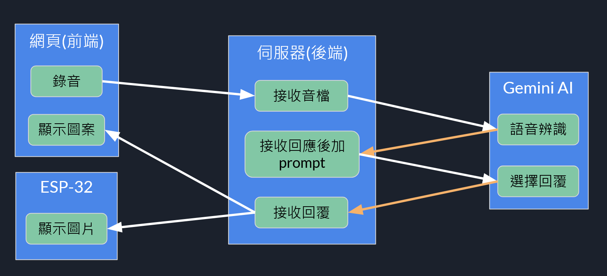
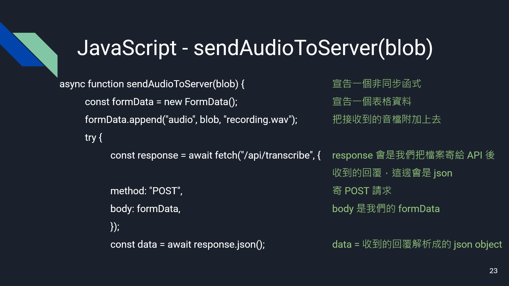

# 陽明交大創客俱樂部社課 - AI 梗圖翻頁機

---

## Content

1. 架構簡介
2. Prompt engineering
3. API 串接
4. ESP32 程式撰寫
5. Docker (有時間的話)

---

## 架構簡介

----



----

[Code](https://github.com/godempty/MyGo_Flipper)

---

## Prompt Engineering

----


### 什麼是 Prompt Engineering？

是設計與優化提示語（prompts）以引導大型語言模型（LLMs）產生期望輸出的技術。
透過精心設計的提示詞，提高模型在各種任務上的表現與可靠性。
~~賽博巫術~~

[Prompt Engineering - Lee Boonstra](https://www.kaggle.com/whitepaper-prompt-engineering)

----

### What is LLM?

----

> it’s a prediction engine. The model takes sequential text as an input and then predicts what the following token should be, based on the data it was trained on. The LLM is operationalized to do this over and over again, adding the previously predicted token to the end of the sequential text for predicting the following token. The next token prediction is based on the relationship between what’s in the previous tokens and what the LLM has seen during its training.

----

### Zero-Shot

定義： 直接給予模型任務指令，無需提供例子。

```text
請將以下句子翻譯成法語：
"The book is on the table."
```

----
<!-- backgroundImage: url("https://top1cdn.top1health.com/cdn/am/20080/63980.jpg") -->

### One-Shot 

<!-- backgroundImage:  -->


定義： 提供一個例子，幫助模型理解任務格式與期望輸出。

```text
英文：Hello → 法文：Bonjour
英文：Goodbye → 法文：
```

----

### Few-Shot

定義： 提供多個例子，幫助模型理解任務格式與期望輸出。

```text
英文：I love you → 法文：Je t'aime
英文：Good morning → 法文：Bonjour
英文：Thank you → 法文：
```

----

### Chain-of-Thought (CoT)

定義： 引導模型逐步推理，透過中間步驟來達成最終答案。

```text
There are 12 cookies. You eat 4 and give away 3. How many are left?  
Let's think step by step.
```

----

### Role/Persona Prompting

定義： 指定模型扮演特定角色，以影響其語氣與回應方式。

```text
你是一位歷史學家，請解釋羅馬帝國的衰落原因。
```

----

### Contextual Prompting


定義： 給模型一些背景知識，引導他產出想要的結果。

```text
The user is traveling to Japan in winter and is allergic to seafood.  
Suggest 2 Japanese meals.
```

----

### Step-Back Prompting

定義：先問廣泛問題以啟動知識，再解任務。

Step-Back Prompt:
```text
What makes a job interview successful?
```

Answer:
> Good communication, confidence, and understanding of the company.

----

**Main Prompt (using above as context):**

```text
Write a checklist for preparing for a job interview using the contents above.
```

----

### Automatic Prompt Engineering

定義：用 AI 產生 Prompt。

```text
Generate 5 different ways to ask:  
"Show me the weather forecast for Tokyo."
```

----

## 攻擊

----

- Jail Breaking
- Prompt Injection
- ...

[OWASP Top 10 for Large Language Model Applications](https://owasp.org/www-project-top-10-for-large-language-model-applications/)
[SITCON 2025 R2｜開發者的暗黑小紅帽：大野狼與 LLM｜講者 slasho](https://youtu.be/ElhRVHl7xAc)

----

## 怎麼辦

----

- 用新一點的模型
- 權限不要給太高
- 限制速率
- multiagent

---

API 串接

----

先去 [Google AI Studio](https://aistudio.google.com/app/apikey?hl=zh-tw) 取得 API key

----

使用套件：

```sh
pip install google-genai
```

----

```py
import google.generativeai as genai

genai.configure(api_key="YOUR_API_KEY", transport="rest")

model = genai.GenerativeModel("gemini-2.0-flash")
response = model.generate_content("講個冷笑話")

print(response.text)
```

----

回顧上次社課



----

#### 要做的事情： 在 `api/transcribe` 這邊接收一個 `wav` 檔，讓 Gemini 選完圖片之後回傳圖片編號

----

Prompt

```py
import json

json_data = open("words.json", "r", encoding="utf-8")
words = json.loads(json_data.read())

prompt = f"""
你現在是一個名為 "MyGO!!!!! Gemini" 的虛擬對話夥伴，你的回答方式會完全採用動畫「Bang Dream! It's my GO!!!!!」中的台詞。

你的主要任務是：
1.  **理解我的對話內容。**
2.  **根據對話內容，從以下提供的台詞中選擇一句最符合情境的台詞。**
3.  **直接回傳所選語句對應的編號，不需要回覆其他文字。**

**以下是你可以選擇的台詞:**
{words}
**舉例：**
如果我的對話是 "早安"，你應該選擇「貴安」或是「早安喵姆喵姆」這句台詞回覆。

必要時可以選擇最有趣的台詞回覆，但請確保回覆的內容與對話內容有關，可能是諧音或是反諷等等。
但你也需要注意，這些台詞是來自動畫中的角色，所以有些台詞可能不適合用在所有情境中。
**舉例：**
如果我的對話是 "你為甚麼不理我"，你可以選擇「是這樣嗎」，或是「我還是會繼續下去」回覆。
**現在，開始吧！**
"""
```

----

語音辨識

```py
import google.generativeai as genai

def transcribe_audio(audio_content):

    model = genai.GenerativeModel("gemini-1.5-flash")
    result = model.generate_content(
        [
            "請將以下語音轉文字並直接輸出，如果有雜音可以忽略，如果全都是雜音或是無法分辨，請回覆「&$%$hu#did」",
            {"mime_type": "audio/wav", "data": audio_content},
        ]
    )
    app.logger.info(f"{result.text=}")
    return result.text
```

----

API

```py
@app.route("/api/transcribe", methods=["POST"])                   # 定義一個路由，處理 POST 請求，路徑為 /api/transcribe
def transcribe():                                                 # 定義一個名為 transcribe 的函式
    if "audio" not in request.files:                              # 檢查請求中是否包含名為 "audio" 的檔案
        return jsonify({"error": "No audio file provided"}), 400  # 如果沒有提供音訊檔案，回傳錯誤訊息和 400 狀態碼
```

----

API

```py
@app.route("/api/transcribe", methods=["POST"])                   # 定義一個路由，處理 POST 請求，路徑為 /api/transcribe
def transcribe():                                                 # 定義一個名為 transcribe 的函式
    if "audio" not in request.files:                              # 檢查請求中是否包含名為 "audio" 的檔案
        return jsonify({"error": "No audio file provided"}), 400  # 如果沒有提供音訊檔案，回傳錯誤訊息和 400 狀態碼
    
    audio_file = request.files["audio"]                           # 從 body 把檔案拿出來
    audio_content = audio_file.read()                             # 讀檔案
    transcript = transcribe_audio(audio_content)                  # 呼叫 transcribe_audio 辨識語音
```

----

API

```py
@app.route("/api/transcribe", methods=["POST"])                   # 定義一個路由，處理 POST 請求，路徑為 /api/transcribe
def transcribe():                                                 # 定義一個名為 transcribe 的函式
    if "audio" not in request.files:                              # 檢查請求中是否包含名為 "audio" 的檔案
        return jsonify({"error": "No audio file provided"}), 400  # 如果沒有提供音訊檔案，回傳錯誤訊息和 400 狀態碼
    
    audio_file = request.files["audio"]                           # 從 body 把檔案拿出來
    audio_content = audio_file.read()                             # 讀檔案
    transcript = transcribe_audio(audio_content)                  # 呼叫 transcribe_audio 辨識語音

    # 將上面的 prompt 作為 system prompt
    model = genai.GenerativeModel(model_name="models/gemini-1.5-flash", system_instruction=prompt)
    response = model.generate_content(f"回覆以下句子:{transcript}")
    generated_text = response.text[:-1]
    app.logger.info(words[generated_text])
    return jsonify({"text": int(generated_text), "pic": words[generated_text]})
```

---

## ESP32 程式撰寫

----

// TODO

----

### 回到 Flask

----

```py
import requests

ESP_IP = "192.168.50.214"
ESP_PORT = 80
ESP_API_URL = f"http://{ESP_IP}:{ESP_PORT}/spin"


def control_esp(value):
    data = {"position": value}
    response = requests.post(f"{ESP_API_URL}", json=data)
    return response.json()

```

----

```py
import esp32_control as esp32_control

@app.route("/api/transcribe", methods=["POST"])
def transcribe():
    if "audio" not in request.files:
        return jsonify({"error": "No audio file provided"}), 400

    # 語音轉文字
    audio_file = request.files["audio"]
    audio_content = audio_file.read()
    transcript = transcribe_audio(audio_content)

    model = genai.GenerativeModel(model_name="models/gemini-1.5-flash", system_instruction=prompt)
    response = model.generate_content(f"回覆以下句子:{transcript}")
    generated_text = response.text[:-1]
    app.logger.info(words[generated_text])
    response = esp32_control.control_esp(int(generated_text))     # 加這行
    app.logger.info(f"send {int(generated_text)} to esp32, {response=}")
    return jsonify({"text": int(generated_text), "pic": words[generated_text]})
```

---

## Docker

----

## 什麼是 Docker？

- Docker 是一個**容器化平台**
- 可以將應用程式與其依賴環境**打包成一個容器**
- 容器是**輕量級**、**可攜式**且**一致性高**

----

## 為什麼要使用 Docker？

- **環境一致性**：不再有「在我電腦可以跑」
- **快速部署**：建置、測試、部署一條龍
- **系統隔離**：每個服務都在獨立的容器中執行
- **支援多平台**：跨 Windows、macOS、Linux

----

## Docker 核心概念

- **Image（映像檔）**：應用程式的模板
- **Container（容器）**：執行中的實體
- **Dockerfile**：自動建構映像檔的腳本
- **Docker Hub**：官方映像檔註冊中心

----

## 安裝 Docker

### Windows / macOS 使用者：
- 安裝 [Docker Desktop](https://www.docker.com/products/docker-desktop)

### Linux:
- [官網](https://docs.docker.com/engine/install/)

----

## Dockerfile

```Dockerfile
FROM python:3.10

WORKDIR /app

RUN pip install --upgrade pip && \
    pip install --no-cache-dir Flask google-generativeai

COPY . .

EXPOSE 5000

CMD ["python3", "/app/app.py"]
```

然後建構映像檔並執行：

```sh
docker build -t my-flask-app .
docker run -p 5000:5000 my-flask-app
```

----


## 什麼是 Docker Compose？

- Docker Compose 是用來**定義與管理多容器應用程式**的工具
- 使用 `docker-compose.yml` 檔案描述服務、網路、掛載等設定

----

## Docker Compose

```yaml
services:
  rust_server:
    build: .
    container_name: rust_server
    networks:
      - my_network
    expose:
      - 8080
    environment:
      - RUST_LOG=info

  nginx_proxy:
    image: nginx:latest
    container_name: nginx_proxy
    networks:
      - my_network
    ports:
      - "80:80"
      - "443:443"
    volumes:
      - ./nginx.conf:/etc/nginx/nginx.conf:ro
      - ./ssl:/etc/nginx/ssl:ro
    depends_on:
      - rust_server

networks:
  my_network:
    driver: bridge
```

----

只要一行指令即可啟動全部服務：

```sh
docker-compose up
```

----

- Docker 解決開發、測試與部署的落差
- Docker Compose 幫你管理多個容器
- 安裝簡單，入門門檻低

----

# END